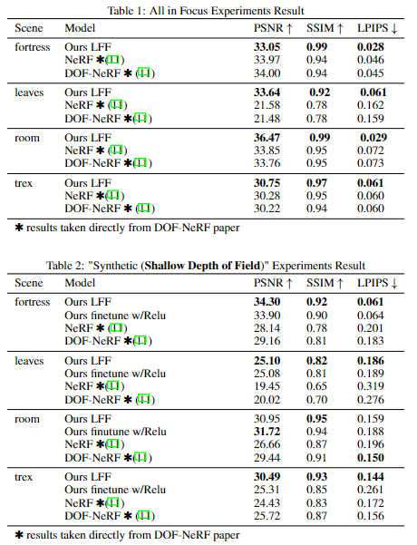

# An improved version of DoF-NeRF
In the final project of Tsinghua Machine Learning 2022 fall course, we proposed a new Latent Foureier function for posiitonal embededding to improve the geometry reconsturction in shallow depth of field (DoF) setting. This repository contains the source code to run the evaluation metrics, and the baseline systems, along with a detailed description of the task. 

# Result Reproduce
**Program running steps:** 

**first step**
**download the LLFF dataset**

Execute the following command line in the directory /nerf_pl/: Run the following command line in the directory for ALL IN FOCUS SETTING:
```
 1. CUDA_VISIBLE_DEVICES=6 python train.py    --dataset_name llff      --N_importance 64 --img_wh 504 378    --num_epochs 30 --batch_size 1024    --optimizer adam --lr 5e-4    --lr_scheduler steplr --decay_step 30 40 --decay_gamma 0.5 --exp_name leaves

 2. CUDA_VISIBLE_DEVICES=6 python train.py    --dataset_name llff      --N_importance 64 --img_wh 504 378    --num_epochs 30 --batch_size 1024    --optimizer adam --lr 5e-4    --lr_scheduler steplr --decay_step 30 40 --decay_gamma 0.5 --exp_name bokeh_leaves --is_bokeh  

 add --is_LFF for our proposed lff embeddings
```


Use Tensorboard to see our results.
```
1. tensorboard --logdir='nerf_pl/logs'
```

# Ours Results


**For more info, please refer to our pdf documentation, thank you.**
